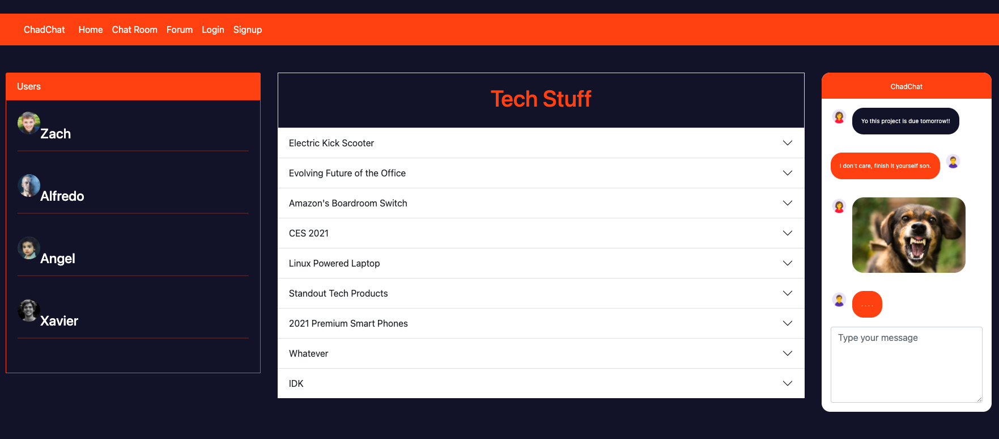

# ChadChat
## Table of Contents
  * [Description](#description)
  * [Technologies](#technologies)
  * [Story](#story)
  * [Demo](#demo)
  * [Deployment](#deployment)
  * [Contributions](#contributions)
## Deployment
[ChadChat](https://chadchat1234.herokuapp.com/)
This app is deployed live on Heroku! (Click Link!)
## Description
    ChadChat was created and designed for users that enjoy forums and chat rooms.
    Chad chat is able to have multiple users that are able to chat with eachother
    by joining rooms with their friends. Users are also able to post to the forum 
    and read others users posts. 
## Technologies
    React JS
    Node and Express
    MongoDB
    Socket.IO
## Story
    - User arrives on the landing page.
    - If the user has an account they can log in using the login form.
    - If the user does not have an account they are able to create one by using 
      the signup form.
    - Once the user is logged in, the user is able to access the whole website .
    - The user can see recent forum posts in the home page.
    - If the user wants to create a forum post they can do it by going to the 
      forum page.
    - Once the user creates a forum post they will be able to see their post and
      recent posts in the forum page.
    - If the user want to join a chat room they can go to the chat room and type 
      in the room they wish to join. 
    - Once the user joins a room the user will get redirected to the room where they
      are able to chat with other users in the same room.
## Demo

## Contributions
[Zachary Taylor](https://github.com/taylor67469)

[Angel Flores](https://github.com/angelfloreschicago)

[Alfredo Tlahuel](https://github.com/Vfredo602)

[Xavier](https://github.com/xavierx91)

## License

